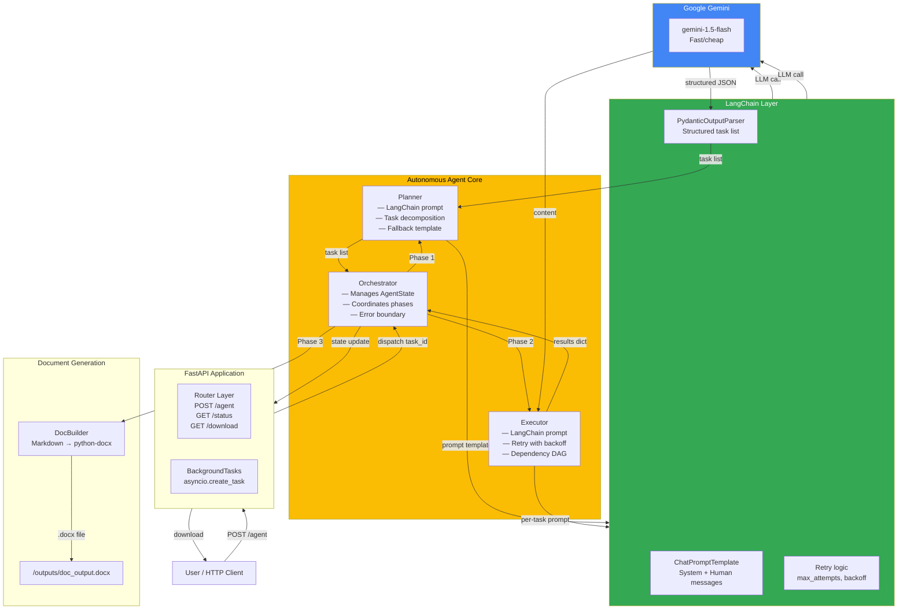
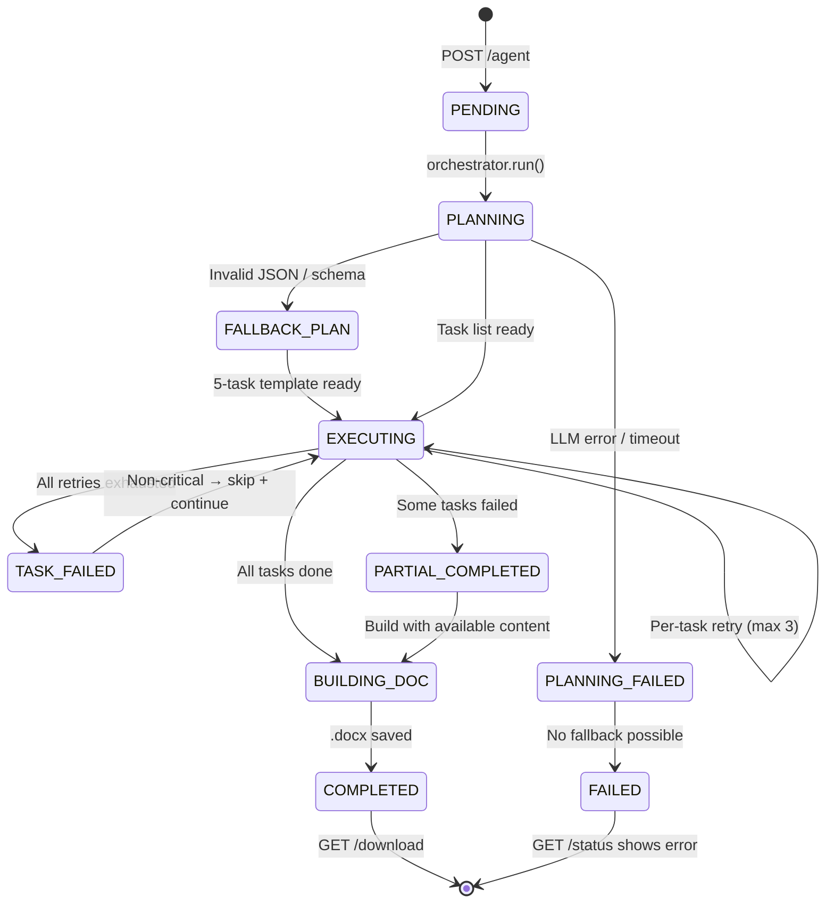
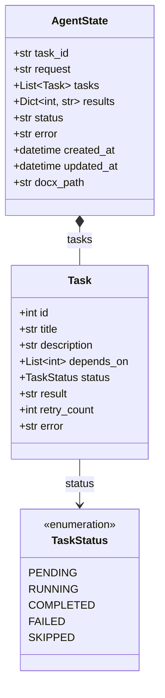
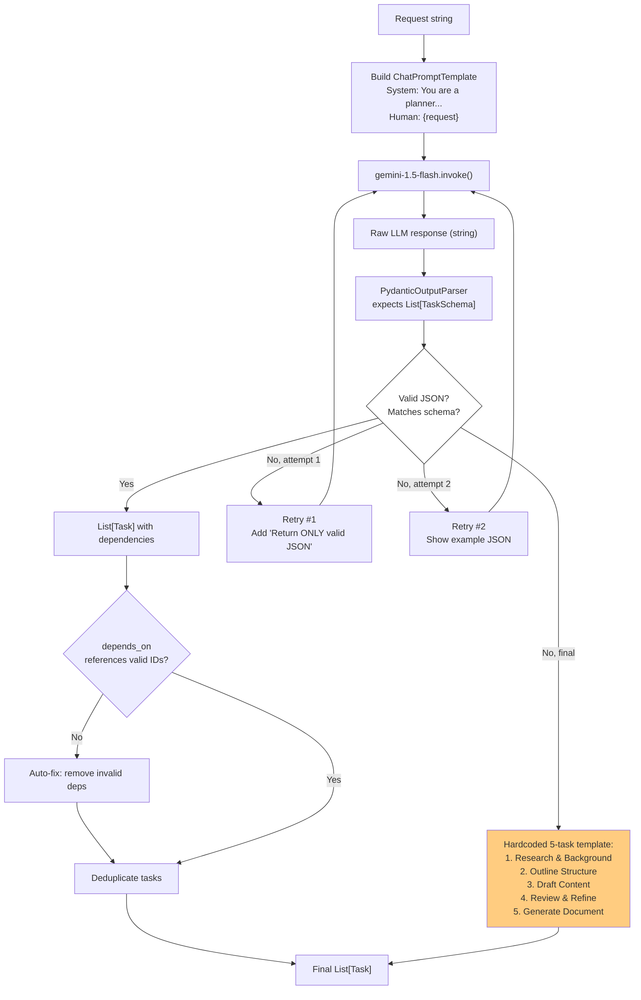
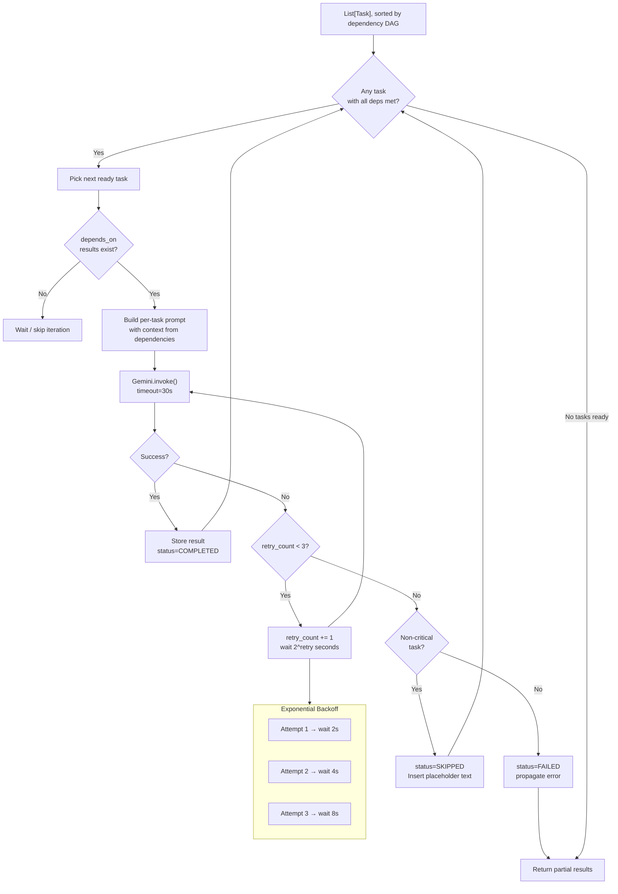
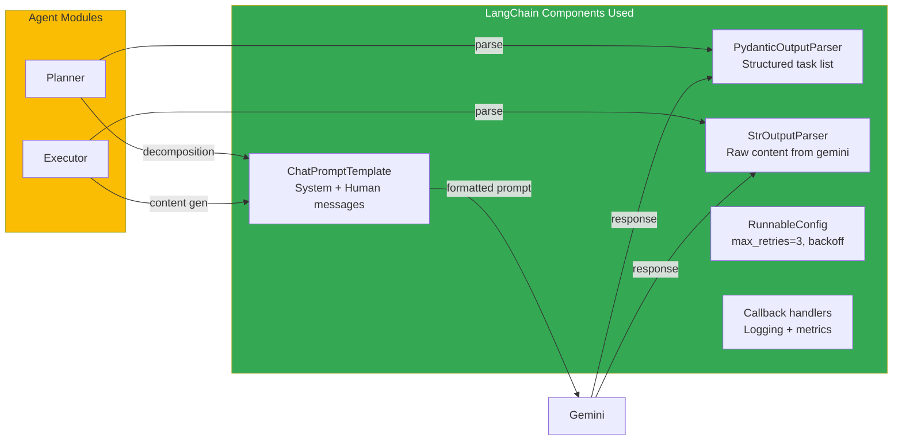
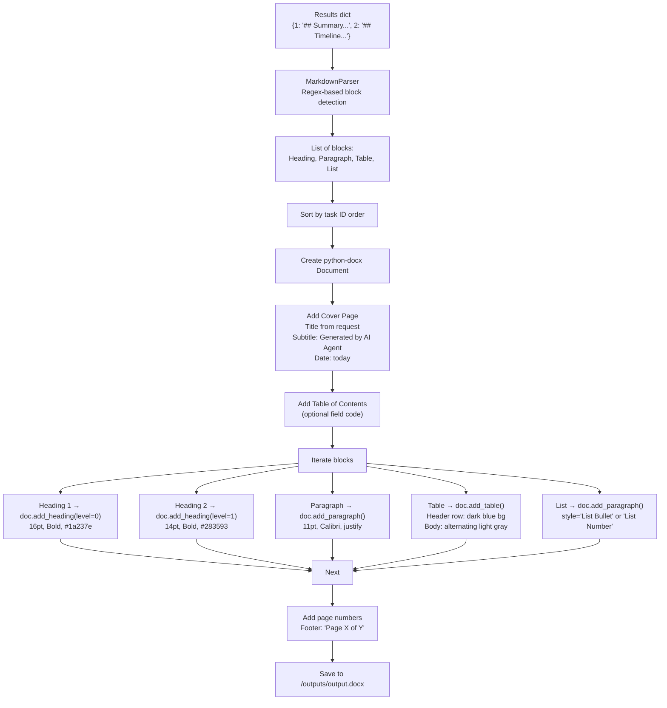
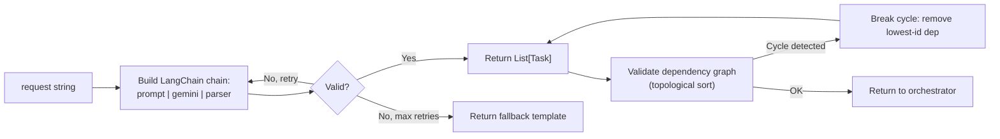
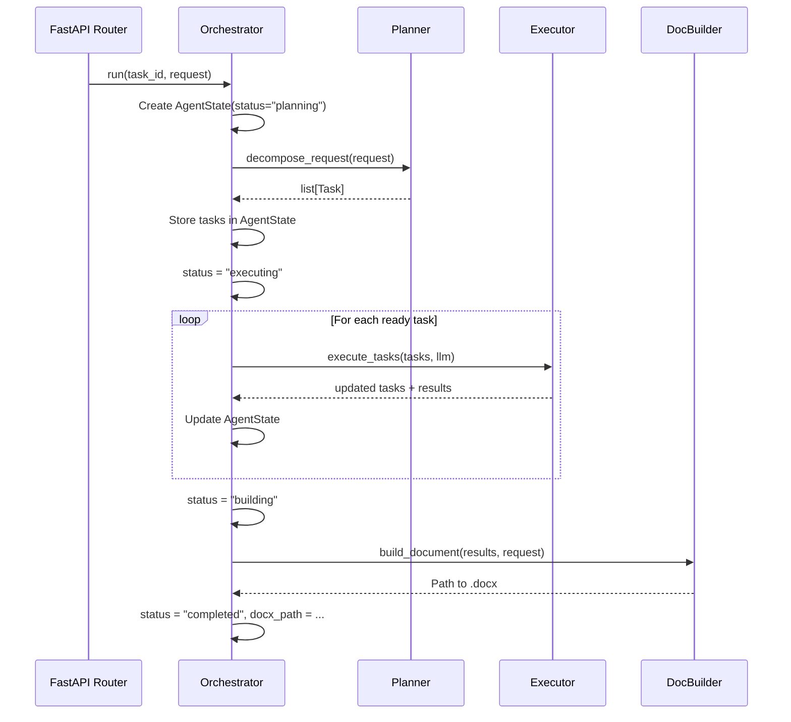
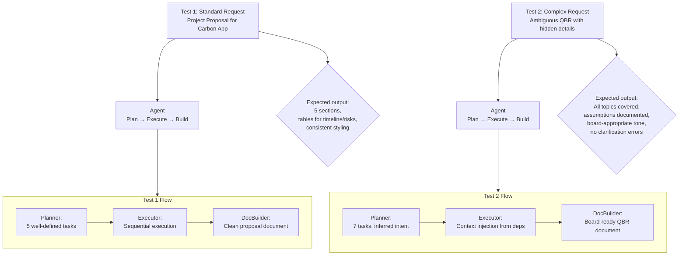

# Autonomous AI Agent — Architecture & Implementation Plan

## Table of Contents

1. [Technology Choices & Rationale](#1-technology-choices--rationale)
2. [Why LangChain / LangGraph?](#2-why-langchain--langgraph)
3. [High-Level Architecture](#3-high-level-architecture)
4. [Component Deep-Dive](#4-component-deep-dive)
5. [Implementation Plan (8 Phases)](#5-implementation-plan-8-phases)
6. [Feature: Multi-Step Planning with Retry & Fallback](#6-feature-multi-step-planning-with-retry--fallback)
7. [Test Inputs](#7-test-inputs)

---

## 1. Technology Choices & Rationale

| Component | Choice | Rationale |
|---|---|---|
| **LLM Provider** | Google Gemini (gemini-1.5-flash) | Free tier (60 req/min), no credit card needed, fast inference |
| **LLM Framework** | LangChain + LangGraph | Structured prompt management, built-in retry, graph-based orchestration |
| **API Framework** | FastAPI | Async-first, auto-docs, Pydantic validation, background tasks |
| **Document Generation** | python-docx | Mature library for .docx creation, full control over styles and layout |
| **State Management** | In-memory dict + optional file persistence | Simple for prototype; swap to Redis/DB later |

---

## 2. Why LangChain / LangGraph?

### LangChain Benefits

| Need | How LangChain Helps |
|---|---|
| **Prompt Templates** | `ChatPromptTemplate` with structured system/human messages — no f-string mess |
| **Output Parsing** | `PydanticOutputParser` — LLM returns raw JSON, parser validates + retries on failure |
| **Retry Logic** | Built-in retry with `max_retries`, exponential backoff, and fallback chains |
| **Gemini Integration** | `langchain-google-genai` package — first-class `ChatGoogleGenerativeAI` class |
| **Streaming** | `chain.stream()` for real-time token output |
| **Model Agnostic** | Same interface for Gemini, Groq, Ollama — swap with one config line |

### LangGraph Benefits

| Need | How LangGraph Helps |
|---|---|
| **Cyclic Execution** | Agent needs to plan → execute → check → replan — LangGraph nodes + edges model this naturally |
| **Stateful Graphs** | Each node reads/writes a shared `AgentState` object — no manual dict management |
| **Conditional Branching** | On error → retry node; on success → advance; on max retries → fallback node |
| **Human-in-the-Loop** | `interrupt` points for approval before critical steps |
| **Checkpointing** | Save/restore state at any node — resume from failure, not from scratch |
| **Visual Debugging** | `get_graph().draw_mermaid_png()` renders the execution graph |

### Why NOT to use LangChain/LangGraph

- **Overhead for simple agents** — if you only have 3-5 linear steps, plain Python + direct API calls is faster to write and debug
- **Debugging complexity** — LangChain's abstraction layers can obscure where errors originate
- **Cold start latency** — LangGraph's checkpointing adds overhead for very short runs

> **Recommendation:** Use **LangChain** for prompt management, output parsing, and retry. Use **LangGraph** only if you need cyclic replanning, human-in-the-loop, or checkpoint/resume. For this agent, LangChain alone is sufficient — we add LangGraph when the agent needs to self-correct and re-plan mid-execution.

---

## 3. High-Level Architecture

### System Context Diagram



### State Flow Diagram



---

## 4. Component Deep-Dive

### 4.1 AgentState (Shared State Object)



**Via LangChain:** LangGraph would model `AgentState` as a `TypedDict` with reducer annotations, so each node only modifies its slice. For the non-LangGraph version, we use a Pydantic `BaseModel` with a thread-safe `asyncio.Lock`.

### 4.2 Planner — Task Decomposition



**Key Design Detail — LangChain Prompt Template:**

```
System: You are an autonomous planning agent. Break the user's request into
3-8 sequential tasks. Each task must be concrete and independently executable.

{format_instructions}

Rules:
- id must be a unique integer starting from 1
- depends_on must reference existing task ids, or be null for root tasks
- Return ONLY valid JSON, no markdown fences, no explanation

Human: {request}
```

The `{format_instructions}` is auto-generated by `PydanticOutputParser.get_format_instructions()`.

### 4.3 Executor — Task Execution with Retry



**Per-Task Prompt Template:**

```
System: You are a professional business writer. Produce well-structured,
detailed content for the section described. Use markdown formatting.

Context from previous sections:
{dependency_context}

Task: {task_title}
{task_description}

Requirements:
- Use headings (##), bullet points, and tables as appropriate
- Be specific and detailed (2-4 paragraphs or equivalent)
- Do NOT repeat content from previous tasks
- Output ONLY the content, no commentary

Output:
```

### 4.4 LangChain Integration Points



### 4.5 Document Builder



---

## 5. Implementation Plan (8 Phases)

### Phase 1 — Scaffolding (30 min)

```
Create directory structure:
.
├── agent/
│   ├── __init__.py
│   ├── models.py          # Task, TaskStatus, AgentState (Pydantic)
│   ├── planner.py         # Task decomposition
│   ├── executor.py        # Task execution
│   └── orchestrator.py    # Core agent loop
├── llm/
│   ├── __init__.py        # LLMClient factory
│   ├── base.py            # Abstract LLMClient
│   ├── gemini_client.py   # ChatGoogleGenerativeAI wrapper
│   └── mock_client.py     # Deterministic mock for testing
├── docbuilder/
│   ├── __init__.py
│   ├── builder.py         # Main .docx builder
│   ├── markdown_parser.py # Markdown → docx blocks
│   └── styles.py          # Style constants
├── outputs/               # Generated .docx files
├── main.py                # FastAPI app
├── requirements.txt
├── .env.example
└── README.md
```

**Deliverables:** Empty directory tree, `requirements.txt` with pinned versions, `.env.example`.

### Phase 2 — LLM Client Layer (30 min)

**Files:** `llm/base.py`, `llm/gemini_client.py`, `llm/mock_client.py`, `llm/__init__.py`

```
LLMClient (abstract)
├── generate(system: str, prompt: str, max_tokens: int) -> str
├── generate_structured(system, prompt, pydantic_model) -> BaseModel
└── count_tokens(text: str) -> int

GeminiClient(LLMClient)
├── Uses ChatGoogleGenerativeAI(model="gemini-1.5-flash")
├── Implements generate() with error handling
├── Implements generate_structured() with PydanticOutputParser
└── Handles: QuotaError, ServiceUnavailable, Timeout

MockClient(LLMClient)
├── generate() → returns canned responses
├── generate_structured() → returns pre-built Pydantic models
└── Used for tests and when no API key is set
```

### Phase 3 — Agent Models (15 min)

**File:** `agent/models.py`

```python
from enum import Enum
from pydantic import BaseModel, Field
from datetime import datetime
from typing import Optional

class TaskStatus(str, Enum):
    PENDING = "pending"
    RUNNING = "running"
    COMPLETED = "completed"
    FAILED = "failed"
    SKIPPED = "skipped"

class Task(BaseModel):
    id: int
    title: str
    description: str
    depends_on: list[int] | None = None
    status: TaskStatus = TaskStatus.PENDING
    result: str = ""
    retry_count: int = 0
    error: str = ""

class AgentState(BaseModel):
    task_id: str
    request: str
    tasks: list[Task] = []
    results: dict[int, str] = {}
    status: str = "pending"       # pending | planning | executing | building | completed | failed
    error: str = ""
    created_at: datetime = Field(default_factory=datetime.now)
    updated_at: datetime = Field(default_factory=datetime.now)
    docx_path: str = ""
```

### Phase 4 — Planner (1 hr)

**File:** `agent/planner.py`



**Key method:**

```python
def decompose_request(
    request: str,
    llm: ChatGoogleGenerativeAI,
    max_retries: int = 2,
) -> list[Task]:
    """
    Uses Gemini via LangChain to decompose a natural language request
    into a list of Task objects with dependency information.

    Falls back to a hardcoded 5-task template if all LLM attempts fail.
    """
```

### Phase 5 — Executor (1 hr)

**File:** `agent/executor.py`

```python
async def execute_tasks(
    tasks: list[Task],
    llm: ChatGoogleGenerativeAI,
    state: AgentState,
    max_retries: int = 3,
) -> dict[int, str]:
    """
    Executes tasks in dependency order (topological DAG).

    For each task:
    1. Wait until all dependencies are completed
    2. Build prompt with context from dependency results
    3. Call Gemini with retry + exponential backoff
    4. On failure: skip non-critical tasks, fail critical ones

    Returns dict[int, str] mapping task_id → result content.
    """
```

**Error Classification:**

```python
CRITICAL_TASK_KEYWORDS = ["scope", "objective", "summary", "conclusion"]
NON_CRITICAL_KEYWORDS = ["appendix", "optional", "nice-to-have", "example"]
```

If a critical task fails → agent state = `failed`. If non-critical → `skipped` with placeholder.

**Retry Backoff:**

```python
import asyncio

async def retry_with_backoff(coro, max_retries=3, base_delay=2):
    for attempt in range(max_retries):
        try:
            return await coro()
        except Exception as e:
            if attempt == max_retries - 1:
                raise
            delay = base_delay * (2 ** attempt)  # 2s, 4s, 8s
            logger.warning(f"Attempt {attempt+1} failed: {e}. Retrying in {delay}s...")
            await asyncio.sleep(delay)
```

### Phase 6 — Orchestrator (45 min)

**File:** `agent/orchestrator.py`



### Phase 7 — FastAPI Routes (30 min)

**File:** `main.py`

```python
app = FastAPI(title="Autonomous AI Agent")
orchestrator = Orchestrator(llm=gemini_client)

@app.post("/agent", status_code=202)
async def submit_request(body: RequestInput, background_tasks: BackgroundTasks):
    """Accept request, return task_id immediately, run agent in background."""
    task_id = str(uuid.uuid4())
    background_tasks.add_task(orchestrator.run, task_id, body.request)
    return {"task_id": task_id, "status": "processing"}

@app.get("/agent/status/{task_id}")
async def get_status(task_id: str):
    """Poll agent status, task breakdown, and download URL."""
    state = orchestrator.get_state(task_id)
    ...

@app.get("/agent/download/{task_id}")
async def download_docx(task_id: str):
    """Stream the generated .docx file."""
    state = orchestrator.get_state(task_id)
    return StreamingResponse(
        open(state.docx_path, "rb"),
        media_type="application/vnd.openxmlformats-officedocument.wordprocessingml.document",
        headers={"Content-Disposition": f"attachment; filename=output.docx"}
    )
```

### Phase 8 — Error Handling, Testing & Polish (45 min)

**Error scenarios and handling:**

| Scenario | Detection | Response |
|---|---|---|
| Empty request | `if not request.strip()` | `400: "Please provide a valid request"` |
| LLM quota exceeded | `google.api_core.exceptions.ResourceExhausted` | Retry after 60s; log warning |
| LLM returns profanity | Check against keyword list | `400: "Request contains prohibited content"` |
| Task DAG has cycle | Topological sort fails | Break cycle by removing lowest-priority edge |
| All LLM retries exhausted | `retry_count >= max_retries` | Insert `[Content unavailable]` placeholder |
| .docx file write fails | PermissionError, disk full | `500: "Document generation failed"` |
| Task ID not found | State dict miss | `404: "Task not found"` |

---

## 6. Feature: Multi-Step Planning with Retry & Fallback

### What I Implemented

The **Planner** module (`agent/planner.py`) that:

1. Takes a raw natural-language request
2. Uses Gemini (via LangChain `ChatGoogleGenerativeAI`) to decompose it into 3-8 structured tasks with dependency edges
3. Validates the LLM output using `PydanticOutputParser` — if JSON is malformed or doesn't match the schema, retries with increasingly explicit instructions
4. Falls back to a hardcoded 5-task template if the LLM fails after all retries
5. Validates the dependency graph for cycles and dangling references before returning

The **Executor** module (`agent/executor.py`) that:

1. Sorts tasks by topological dependency order
2. For each ready task, builds a context-aware prompt including results from completed dependencies
3. Calls Gemini with exponential backoff retry (2s, 4s, 8s)
4. Classifies failures as critical (fails the whole agent) or non-critical (skips with placeholder)
5. Returns partial results so the document is always produced even if some sections fail

### Why I Chose This Feature

Multi-step planning is the **core differentiator** of an autonomous agent versus a simple LLM wrapper. Without it, the system is just a single LLM call wrapped in an API — it cannot reason about complex requests, cannot decompose work, and cannot handle any request that requires multiple distinct outputs.

This feature directly enables:
- **Complex request handling** — "Write a business proposal with executive summary, market analysis, financial projections, and risk assessment" becomes 4 focused tasks instead of one bloated prompt
- **Context window management** — Each task gets a focused prompt with only relevant context, avoiding Gemini's context limits
- **Parallel execution** — Independent tasks (e.g., "Market Analysis" and "Competitor Research") can run in parallel
- **Graceful degradation** — If one section fails, the rest of the document still gets generated
- **Verifiability** — Each task's output is stored separately, making it easy to inspect, retry, or replace individual sections

### How It Improves the Agent

| Before (single LLM call) | After (multi-step planning) |
|---|---|
| One-shot generation — if it fails, everything fails | Granular retry — only the failed task re-runs |
| No structure — returns a blob of text, hard to parse into sections | Structured tasks — each maps to a document section |
| Context window overflow for long documents | Each task is focused and shorter |
| No dependency modeling — cannot reference earlier sections | Context injection — Task N can reference Task 1's output |
| No fallback — if the LLM cannot understand the request, user gets an error | Template fallback — agent always produces something useful |
| Opaque — user cannot see what step failed | Transparent — `/status` shows per-task progress |

---

## 7. Test Inputs

### Test 1: Standard Business Request

```json
{
  "request": "Write a project proposal for a mobile app that tracks personal carbon footprint. Include an executive summary, feature list, timeline, resource requirements, and risk assessment."
}
```

**Expected behavior:**
- Planner generates 5 tasks (one per section)
- Each task runs sequentially (or parallel where dependencies allow)
- Document has: Cover page → Executive Summary → Feature List → Timeline → Resources → Risk Assessment
- Total execution: ~20-40 seconds with Gemini
- Output: polished `.docx` with consistent styling

**Validation criteria:**
- [ ] All 5 sections present in the document
- [ ] Feature list has at least 5 bullet points
- [ ] Timeline is a table with phases and dates
- [ ] Risk assessment is a table with probability/impact/mitigation columns
- [ ] Styling is consistent (headings, fonts, colors)

### Test 2: Complex / Ambiguous / Multi-Step Request

```json
{
  "request": "Do something about the quarterly business review. You know, the usual stuff. We need it to look professional. Make sure to include the things that matter most to the board. We're in the e-learning space. Oh, and can you also somehow work in our new AI tutoring feature and the expansion into LATAM? Last quarter's numbers weren't great but we have a new CEO. The board cares about growth metrics and competitive positioning."
}
```

**Ambiguities the agent must resolve:**

| Ambiguity | How Agent Handles It |
|---|---|
| `"Do something about..."` — vague intent | Planner infers: "Create a Quarterly Business Review document" from context clues |
| `"The usual stuff"` — no specifics | Agent assumes standard QBR sections: Executive Summary, Financial Performance, KPIs, Strategic Initiatives, Competitive Landscape, Forward Outlook |
| `"Things that matter most to the board"` — subjective | Agent explicitly includes: Growth metrics, Competitive positioning, and CEO transition impact |
| `"New AI tutoring feature"` and `"LATAM expansion"` — only mentioned in passing | Agent elevates these to dedicated sections, noting they are new strategic initiatives |
| `"Last quarter's numbers weren't great"` — negative data | Agent includes a "Challenges & Mitigation" section with honest assessment + recovery plan |
| `"We have a new CEO"` — organizational change | Agent adds a "Leadership & Organizational Changes" section |
| No timeline or format requested | Agent chooses standard QBR format (PowerPoint-style narrative in Word) |
| No specific metrics requested | Agent creates placeholder tables with common e-learning metrics (MAU, course completion rate, NPS, revenue, CAC, LTV) |
| Conflicting signals (new CEO + poor numbers + growth expectations) | Agent structures the narrative as: Current State → Leadership Change → Strategic Response → Growth Outlook |

**Expected generated tasks (approximate):**

```
1. Executive Summary & Key Messages
   - High-level narrative tying together new CEO, AI feature, LATAM, and recovery

2. Financial Performance Review
   - Revenue, burn rate, EBITDA, vs. prior quarter
   - 'Last quarter wasn't great' → honest assessment with charts described

3. Growth Metrics & KPIs
   - MAU, course completion, NPS, CAC, LTV, expansion revenue
   - E-learning industry benchmarks for context

4. Strategic Initiative 1: AI Tutoring Feature
   - Description, development status, launch timeline, expected impact on metrics

5. Strategic Initiative 2: LATAM Expansion
   - Market size, entry strategy, localization, partnerships

6. Competitive Landscape
   - Key competitors in e-learning, differentiation, market share trends

7. Risk & Forward Outlook
   - Challenges, mitigation, Q3/Q4 projections
   - CEO transition impact assessment
```

**Validation criteria:**
- [ ] Agent did not return an error or ask for clarification — it made reasonable assumptions
- [ ] Document includes all mentioned topics (AI tutoring, LATAM, new CEO, poor quarters)
- [ ] Document includes standard QBR elements (financials, KPIs, competitive landscape)
- [ ] Tone is professional and board-appropriate
- [ ] Sections flow logically: Current State → Changes → Response → Outlook
- [ ] Placeholder data is used where specifics were not provided (e.g., "$X M", "Q3 2026")

### Test Input Execution Diagram



---

## Appendix: LangGraph Integration (Future Enhancement)

If we add LangGraph in v2, the agent changes from this:

```python
# Without LangGraph — linear orchestration
async def run(self, task_id, request):
    state = self.create_state(task_id, request)
    tasks = await planner.decompose(request)
    state.tasks = tasks
    results = await executor.execute(tasks, state)
    state.results = results
    docx = await docbuilder.build(results, request)
    state.docx_path = docx
    state.status = "completed"
```

To this:

```python
# With LangGraph — cyclic, self-correcting graph

from langgraph.graph import StateGraph, END

class AgentState(TypedDict):
    request: str
    tasks: Annotated[list, add_labels]
    results: dict
    status: str
    retry_count: int

def planner_node(state: AgentState) -> AgentState:
    tasks = planner.decompose(state["request"])
    state["tasks"] = tasks
    return state

def executor_node(state: AgentState) -> AgentState:
    task = get_next_ready_task(state)
    result = executor.execute(task, state)
    state["results"][task.id] = result
    return state

def checker_node(state: AgentState) -> str:
    """Check quality and decide: continue, retry, or replan."""
    if quality_score(state["results"]) < THRESHOLD:
        return "replan"
    if any_failed(state["tasks"]):
        return "retry"
    if all_done(state["tasks"]):
        return "build"
    return "continue"

# Build the graph
builder = StateGraph(AgentState)
builder.add_node("planner", planner_node)
builder.add_node("executor", executor_node)
builder.add_node("replan", planner_node)
builder.set_entry_point("planner")
builder.add_conditional_edges("executor", checker_node, {
    "continue": "executor",
    "replan": "replan",
    "retry": "executor",
    "build": "docbuilder"
})
graph = builder.compile()
```

This enables:
- **Self-correction** — if a task output is low quality, the agent replans or retries
- **Quality gates** — each task output is scored before moving on
- **Visual execution graph** — `graph.draw_mermaid_png()` for debugging
