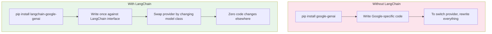

# 1. LangChain Basics

## The Problem LangChain Solves

Without LangChain, calling Gemini looks like this:

```python
# Raw API call — you must handle everything yourself
import google.generativeai as genai

genai.configure(api_key="YOUR_KEY")
model = genai.GenerativeModel("gemini-1.5-flash")
response = model.generate_content("Hello")
print(response.text)
```

Problems with raw calls:
- Every LLM provider has a different API (Google, OpenAI, Groq, Anthropic)
- No standard way to structure prompts
- No built-in retry, error handling, or output parsing
- Mixing f-strings into prompts gets messy fast

## LangChain's Solution

LangChain wraps the LLM in a standard interface:

```python
from langchain_google_genai import ChatGoogleGenerativeAI

# Same interface for ANY provider
llm = ChatGoogleGenerativeAI(model="gemini-1.5-flash")
response = llm.invoke("Hello")
print(response.content)  # Standardized output
```

### Provider Swap (Zero Code Changes)

```python
# Swap between providers by changing ONE import
# Google Gemini
llm = ChatGoogleGenerativeAI(model="gemini-1.5-flash")

# Groq
llm = ChatGroq(model="mixtral-8x7b-32768")

# OpenAI
llm = ChatOpenAI(model="gpt-4o")

# Ollama (local)
llm = ChatOllama(model="llama3")

# The rest of your code NEVER changes
response = llm.invoke("Hello")
```

```mermaid
graph LR
    App["Your App"] -->|llm.invoke()| LC["LangChain Interface"]
    LC -->|ChatGoogleGenerativeAI| G["Google Gemini"]
    LC -->|ChatGroq| Gr["Groq"]
    LC -->|ChatOpenAI| O["OpenAI"]
    LC -->|ChatOllama| Ol["Ollama"]
    
    style LC fill:#34A853,color:#fff
```

## Key Concepts

### 1. Messages

LLMs use a message-based format. LangChain has standard message types:

```
SystemMessage    → "You are a helpful assistant."  (sets behavior)
HumanMessage     → "What is Python?"              (user input)
AIMessage        → "Python is a language..."      (model response)
```

### 2. Invoke

`llm.invoke()` sends messages to the LLM and returns the full response object:

```python
from langchain_core.messages import HumanMessage, SystemMessage
from langchain_google_genai import ChatGoogleGenerativeAI

llm = ChatGoogleGenerativeAI(model="gemini-1.5-flash")

messages = [
    SystemMessage("You are a business analyst."),
    HumanMessage("Write a one-sentence executive summary for a carbon-tracking app."),
]

response = llm.invoke(messages)
print(response.content)
# "CarbonTrack is a mobile application that..."
```

### 3. Streaming

Get tokens as they arrive:

```python
for chunk in llm.stream("Write a short poem about AI."):
    print(chunk.content, end="", flush=True)
```

## What's NOT in LangChain

LangChain does NOT run the LLM locally — it connects TO the LLM.
LangChain does NOT replace Python — it's a library YOU import.
LangChain does NOT add latency — the LLM call is the slow part.

## Visual Summary



## Next

Learn how to build structured prompts with `ChatPromptTemplate` in `02_prompts_and_chains.md`.
