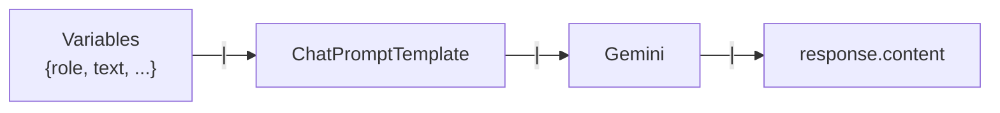
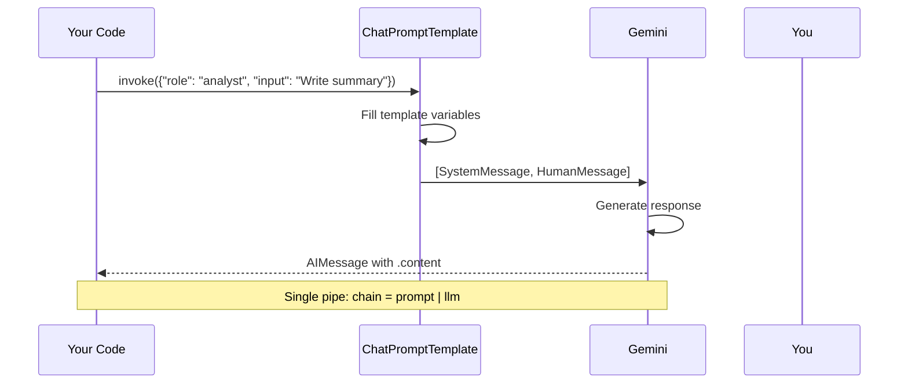

# 2. Prompts and Chains

## The Problem

Raw f-string prompts are fragile:

```python
# Bad: hard to maintain, no structure
prompt = f"""
System: You are a {role}.
Translate {input_language} to {output_language}.
Text: {text}
"""
```

Problems:
- No separation between system instructions and user input
- Hard to reuse prompt components
- No type checking on variables
- Messy when variables contain special characters

## ChatPromptTemplate

LangChain's `ChatPromptTemplate` separates structure from content:

```python
from langchain_core.prompts import ChatPromptTemplate
from langchain_google_genai import ChatGoogleGenerativeAI

# Step 1: Define the template
prompt = ChatPromptTemplate.from_messages([
    ("system", "You are a {role}. Translate {input_language} to {output_language}."),
    ("human", "{text}"),
])

# Step 2: Fill in the variables
filled = prompt.invoke({
    "role": "professional translator",
    "input_language": "English",
    "output_language": "French",
    "text": "Hello, how are you?",
})

# Step 3: See what gets sent to the LLM
print(filled)
# [
#   SystemMessage("You are a professional translator..."),
#   HumanMessage("Hello, how are you?")
# ]
```

## Chains: The Pipe Operator `|`

The pipe `|` connects components into a pipeline:



```python
from langchain_core.prompts import ChatPromptTemplate
from langchain_google_genai import ChatGoogleGenerativeAI

llm = ChatGoogleGenerativeAI(model="gemini-1.5-flash")

# Build the pipeline with |
chain = ChatPromptTemplate.from_messages([
    ("system", "You are a {role}."),
    ("human", "{input}"),
]) | llm

# Run it — input flows through prompt → LLM
result = chain.invoke({
    "role": "business analyst",
    "input": "Summarize the Q3 financial results.",
})

print(result.content)
```

## Why This Matters for the Agent

In our autonomous agent, we use `ChatPromptTemplate` for EVERY LLM call:

```python
# Planner prompt
planner_prompt = ChatPromptTemplate.from_messages([
    ("system", "You are a task planner. Break requests into steps.\n{format_instructions}"),
    ("human", "{request}"),
])

# Executor prompt
executor_prompt = ChatPromptTemplate.from_messages([
    ("system", "You are a business writer. Use context from previous sections:\n{context}"),
    ("human", "Write the section: {task_title}\n{task_description}"),
])

# Both use the SAME llm instance
chain = executor_prompt | llm
```

## Visual: How Data Flows Through a Chain



## Runnable Interface

Every LangChain component implements the `Runnable` interface, meaning they all support:

| Method | What it does | Use case |
|---|---|---|
| `invoke(input)` | Run once, wait for result | Standard API calls |
| `stream(input)` | Run, yield tokens as they arrive | Real-time display |
| `batch(inputs)` | Run multiple inputs | Bulk processing |
| `ainvoke(input)` | Async version | FastAPI endpoints |

This is why `prompt | llm` works — both are Runnables.

## Key Takeaway

```
chain = prompt | llm
     ^        ^     ^
     |        |     |
  input   template  model
  dict    fills     generates
          messages  response
```

Everything in LangChain is built by connecting Runnables with `|`.

## Next

Learn to parse structured output from the LLM in `03_output_parsers.md`.
