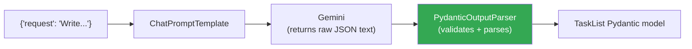
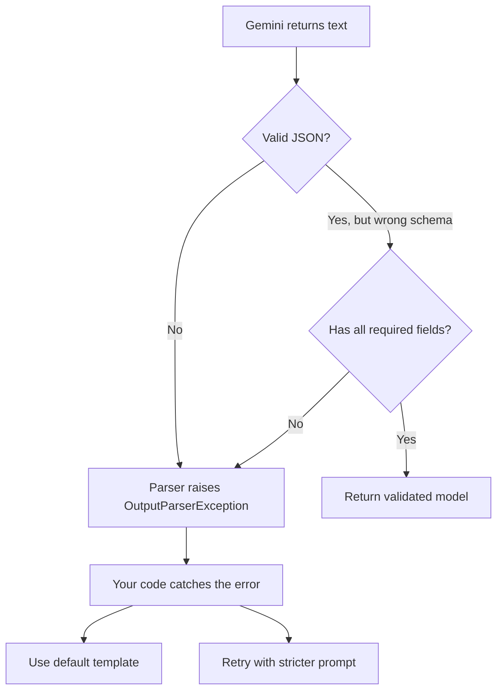

# 3. Output Parsers

## The Problem

LLMs return text. You need structured data (JSON, lists, objects).

Without a parser, you write fragile extraction code:

```python
# Fragile: depends on exact LLM wording
response = llm.invoke("List 3 colors as JSON")
raw = response.content  # "Here is the JSON:\n{\"colors\": [\"red\",...]}"

# Manual extraction — breaks if LLM changes format
import json
try:
    # Skip the preamble
    json_str = raw.split("```json")[1].split("```")[0]
    data = json.loads(json_str)
except:
    # Hope and pray
    data = json.loads(raw)
```

## PydanticOutputParser

LangChain's `PydanticOutputParser` does this for you:

```python
from pydantic import BaseModel, Field
from langchain_core.prompts import ChatPromptTemplate
from langchain_core.output_parsers import PydanticOutputParser
from langchain_google_genai import ChatGoogleGenerativeAI

# Step 1: Define your data structure
class Task(BaseModel):
    id: int = Field(description="Unique task ID")
    title: str = Field(description="Task title, max 10 words")
    description: str = Field(description="What to do, 1-2 sentences")
    depends_on: list[int] | None = Field(description="IDs of tasks that must finish first")

class TaskList(BaseModel):
    tasks: list[Task] = Field(description="List of tasks to execute")

# Step 2: Create the parser
parser = PydanticOutputParser(pydantic_object=TaskList)

# Step 3: Build prompt with format instructions
prompt = ChatPromptTemplate.from_messages([
    ("system", "Break the request into tasks.\n{format_instructions}"),
    ("human", "{request}"),
])

# Step 4: Fill format_instructions automatically
filled_prompt = prompt.invoke({
    "request": "Write a project proposal with summary, timeline, and risks",
    "format_instructions": parser.get_format_instructions(),
})

# See what gets sent to the LLM:
print(filled_prompt)
# System: Break the request into tasks.
# You must return a JSON object with this exact structure:
# {
#   "tasks": [
#     {"id": 1, "title": "...", "description": "...", "depends_on": null},
#     ...
#   ]
# }
# Human: Write a project proposal...
```

## Full Chain with Parser

```python
chain = prompt | llm | parser

# Run it — text goes in, Pydantic model comes out
result: TaskList = chain.invoke({
    "request": "Write a project proposal",
    "format_instructions": parser.get_format_instructions(),
})

# Result is a validated Python object
print(result.tasks[0].title)       # "Executive Summary"
print(result.tasks[0].depends_on)  # None
print(type(result))                 # <class '__main__.TaskList'>
```



## What Happens on Bad Output



## In the Agent's Planner

This is exactly how our agent decomposes requests:

```python
from pydantic import BaseModel, Field
from langchain_core.output_parsers import PydanticOutputParser

class TaskSchema(BaseModel):
    id: int
    title: str
    description: str
    depends_on: list[int] | None = None

class PlanSchema(BaseModel):
    tasks: list[TaskSchema]

parser = PydanticOutputParser(pydantic_object=PlanSchema)

planner_chain = planner_prompt | llm | parser

try:
    plan = planner_chain.invoke({
        "request": user_request,
        "format_instructions": parser.get_format_instructions(),
    })
except:
    # Fallback: use hardcoded 5-task template
    plan = get_fallback_plan()
```

## Key Takeaway

```
chain = prompt | llm | parser
                       ^
                       |
               PydanticOutputParser
               converts text → Python objects
               validates ✅
               gives clear errors on bad output ✅
```

## Next

Learn how LangGraph adds stateful, cyclic execution in `04_langgraph_intro.md`.
