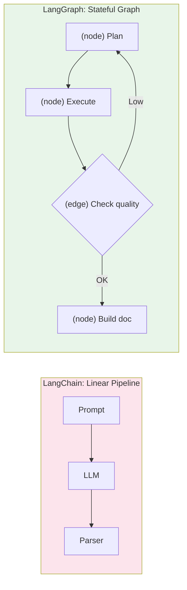
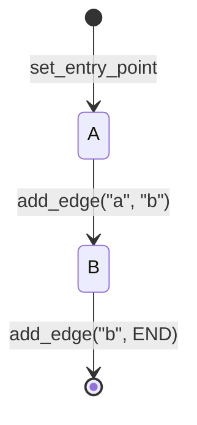
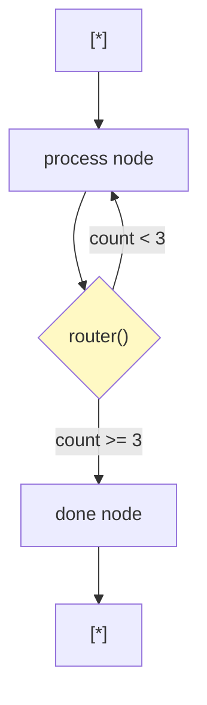
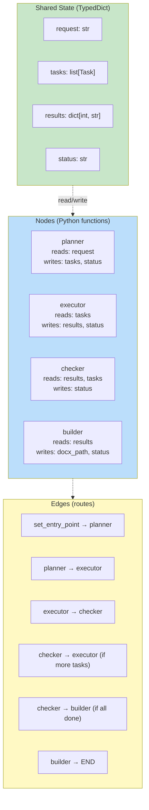

# 4. LangGraph Basics

## The Problem LangGraph Solves

LangChain chains are **linear** — data flows in one direction, no loops.

```python
# LangChain: one direction, no going back
chain = prompt | llm | parser
result = chain.invoke(input)
# Done. Cannot retry a specific step.
# Cannot check quality and re-do.
```

But an autonomous agent needs to:
- Execute step 1 → check quality → if bad, re-do step 1
- Execute step 2 → if step 2 fails, decide: retry or skip?
- If overall quality is low → re-plan and start over

**LangGraph** turns chains into **graphs** — you define nodes and edges, and the graph can loop, branch, and make decisions.



## Core Concepts

### 1. State

A shared dictionary-like object that EVERY node can read and write:

```python
from typing import TypedDict

class AgentState(TypedDict):
    request: str          # Original user request
    tasks: list           # Planned tasks
    results: dict         # Completed task outputs
    status: str           # Current status
    errors: list          # Any errors encountered
```

### 2. Nodes

Functions that receive the state, do work, and RETURN UPDATED STATE:

```python
def planner_node(state: AgentState) -> AgentState:
    """Reads state['request'], writes state['tasks']."""
    tasks = decompose_request(state["request"])
    state["tasks"] = tasks
    state["status"] = "planned"
    return state  # MUST return updated state

def executor_node(state: AgentState) -> AgentState:
    """Reads state['tasks'], writes state['results']."""
    task = get_next_ready_task(state["tasks"])
    result = llm.invoke(f"Write section: {task}")
    state["results"][task["id"]] = result.content
    state["status"] = "executed"
    return state
```

### 3. Edges

Edges define the flow between nodes:

```python
# Simple edge: always go from A to B
graph.add_edge("planner", "executor")

# Conditional edge: decide based on state
graph.add_conditional_edges(
    "executor",
    lambda state: "completed" if all_done(state) else "executor"
)
```

## Building a Graph: Step by Step

### Step 1: Define state

```python
from typing import TypedDict, Annotated

# Annotated with operators lets LangGraph know HOW to merge state updates
def merge_lists(a: list, b: list) -> list:
    return a + b

class GraphState(TypedDict):
    messages: Annotated[list, merge_lists]  # Append new messages
    count: int                               # Overwrite on each update
```

### Step 2: Define nodes

```python
from langgraph.graph import StateGraph, END

def node_a(state: GraphState) -> GraphState:
    state["messages"].append("Hello from A")
    state["count"] = state.get("count", 0) + 1
    return state

def node_b(state: GraphState) -> GraphState:
    state["messages"].append("Hello from B")
    return state
```

### Step 3: Build the graph

```python
# Create a builder with the state schema
builder = StateGraph(GraphState)

# Add nodes
builder.add_node("a", node_a)
builder.add_node("b", node_b)

# Add edges
builder.set_entry_point("a")   # Start at node "a"
builder.add_edge("a", "b")     # Always go a → b
builder.add_edge("b", END)     # End after b

# Compile into a runnable graph
graph = builder.compile()
```

### Step 4: Run the graph

```python
# Initial state
initial = {"messages": [], "count": 0}

# Run
result = graph.invoke(initial)

print(result["messages"])  # ["Hello from A", "Hello from B"]
print(result["count"])     # 1
```



## Conditional Edges: Making Decisions

This is where LangGraph shines — nodes can decide what happens next:

```python
def router(state: GraphState) -> str:
    """Return the name of the NEXT node to execute."""
    if state["count"] >= 3:
        return "done"        # Go to 'done' node
    return "process"         # Go to 'process' node

# Build
builder = StateGraph(GraphState)
builder.add_node("process", process_node)
builder.add_node("done", done_node)
builder.set_entry_point("process")

# Conditional edge — router decides the next node
builder.add_conditional_edges(
    "process",           # Source node
    router,              # Function that returns next node name
    {
        "process": "process",  # If router returns "process" → go to process
        "done": "done",        # If router returns "done" → go to done
    }
)
builder.add_edge("done", END)

graph = builder.compile()
result = graph.invoke({"messages": [], "count": 0})
```



## Visual: Full LangGraph Architecture



## Key Differences: LangChain vs LangGraph

| Aspect | LangChain | LangGraph |
|---|---|---|
| Flow | Linear pipe `|` | Graph with nodes + edges |
| State | Passed forward only | Shared, mutable, any node can read/write |
| Loops | Not possible | Natural (conditional edges) |
| Decision logic | None | Router functions decide next node |
| Best for | Simple request → response | Multi-step, conditional, self-correcting agents |

## When to Use LangGraph

Use LangGraph when your agent needs to:

- **Re-plan** — if output quality is bad, go back to planning
- **Retry** — if a task fails, retry or skip
- **Branch** — execute independent tasks in parallel
- **Check quality** — score output before proceeding
- **Human approval** — pause and wait for user input

```python
# Simple agent: LangChain is enough
chain = prompt | llm | parser

# Complex agent: LangGraph is better
graph = StateGraph(AgentState)
graph.add_node("plan", planner)
graph.add_node("execute", executor)
graph.add_conditional_edges("execute", quality_check, {
    "pass": "build",
    "fail": "execute",
    "replan": "plan"
})
```

## Next

See how to build the complete autonomous agent with LangGraph in `05_agent_with_langgraph.md`.
