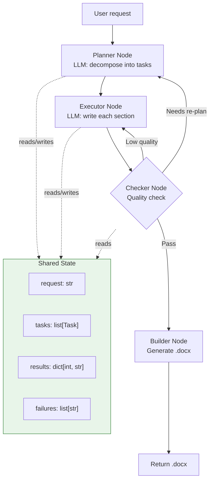
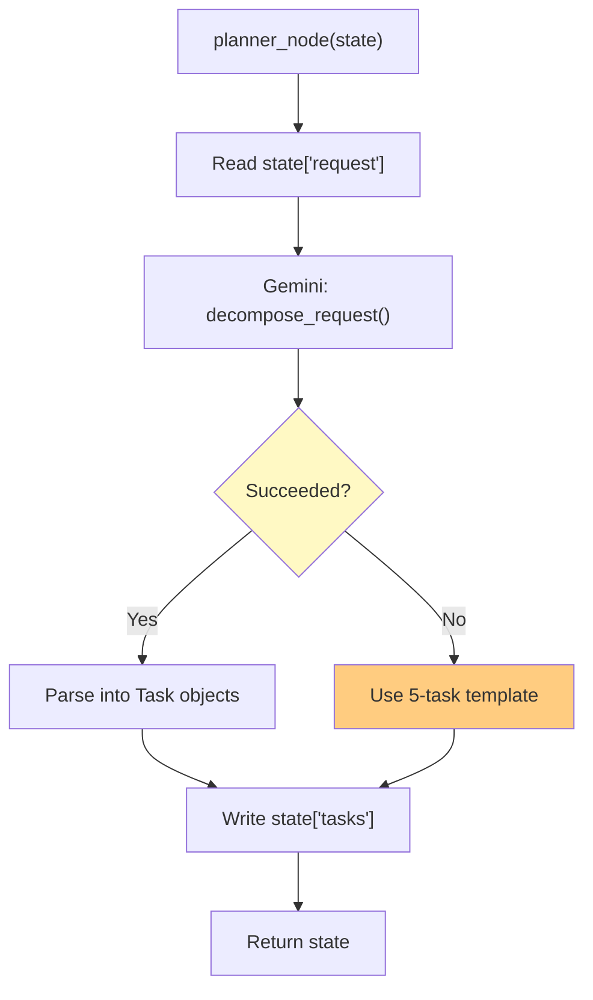
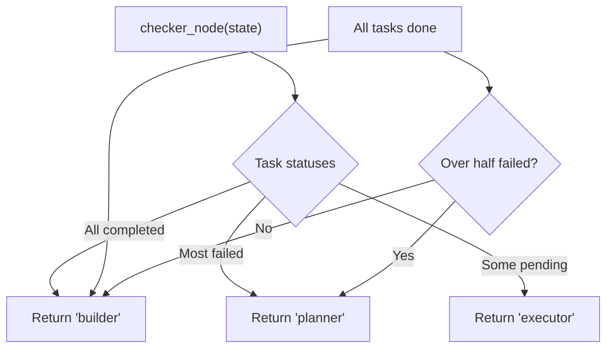
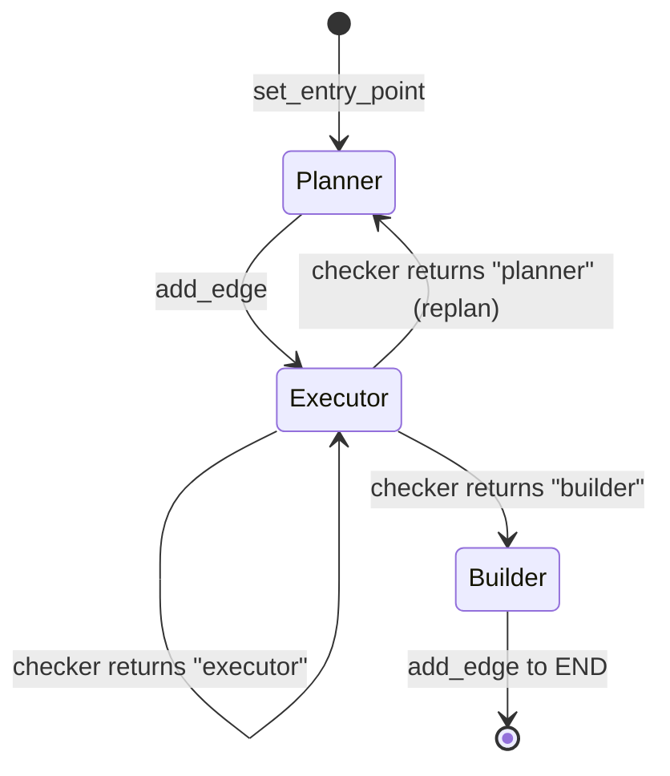

# 5. Building the Autonomous Agent

Now we put everything together — LangChain for prompts + parsers, LangGraph for stateful execution.

## What We're Building

An agent that:

1. **Accepts** a natural-language request
2. **Plans** by decomposing into structured tasks (using LangChain prompt + parser)
3. **Executes** each task with context from previous tasks
4. **Checks** quality and decides: advance, retry, or replan
5. **Builds** a .docx document from all results



## Full Code

### 0. Imports and Setup

```python
import json
import uuid
from typing import TypedDict, Annotated, Literal

from langchain_core.prompts import ChatPromptTemplate
from langchain_core.output_parsers import PydanticOutputParser
from langchain_core.messages import HumanMessage, SystemMessage
from langchain_google_genai import ChatGoogleGenerativeAI
from pydantic import BaseModel, Field
from langgraph.graph import StateGraph, END

llm = ChatGoogleGenerativeAI(model="gemini-1.5-flash")
```

### 1. Define State

```python
class Task(BaseModel):
    id: int
    title: str
    description: str
    depends_on: list[int] | None = None
    status: str = "pending"  # pending | running | completed | failed

def merge_results(a: dict, b: dict) -> dict:
    """Merge new results into existing results dict."""
    return {**a, **b}

class AgentState(TypedDict):
    request: str
    tasks: list[Task]
    results: Annotated[dict, merge_results]
    failures: list[str]
    docx_path: str
```

### 2. Define Pydantic Schemas (for Output Parser)

```python
class TaskSchema(BaseModel):
    id: int = Field(description="Unique task ID, starting from 1")
    title: str = Field(description="Short task title, under 10 words")
    description: str = Field(description="What to produce, 1-2 sentences")
    depends_on: list[int] | None = Field(None, description="IDs of prerequisite tasks")

class PlanSchema(BaseModel):
    tasks: list[TaskSchema]
```

### 3. Build Nodes

#### Planner Node

```python
def planner_node(state: AgentState) -> AgentState:
    """
    Uses Gemini to decompose the request into structured tasks.
    Falls back to a hardcoded template on failure.
    """
    parser = PydanticOutputParser(pydantic_object=PlanSchema)
    
    prompt = ChatPromptTemplate.from_messages([
        ("system", "You are a task planner. Break the request into 3-8 tasks.\n{format_instructions}"),
        ("human", "{request}"),
    ])
    
    chain = prompt | llm | parser
    
    try:
        plan = chain.invoke({
            "request": state["request"],
            "format_instructions": parser.get_format_instructions(),
        })
        state["tasks"] = [Task(**t.model_dump()) for t in plan.tasks]
    except Exception as e:
        # Fallback: 5-task template
        state["tasks"] = [
            Task(id=1, title="Executive Summary", description="Write a summary of the request"),
            Task(id=2, title="Background Research", description="Research context and background"),
            Task(id=3, title="Main Content", description="Write the main body content", depends_on=[1, 2]),
            Task(id=4, title="Analysis", description="Analyze findings", depends_on=[3]),
            Task(id=5, title="Conclusion", description="Write conclusion and next steps", depends_on=[4]),
        ]
        state["failures"].append(f"Planner used fallback: {e}")
    
    return state
```



#### Executor Node

```python
def executor_node(state: AgentState) -> AgentState:
    """
    Finds the next ready task (all dependencies completed),
    executes it with context, and stores the result.
    """
    # Find a task whose dependencies are all done
    ready_task = None
    for task in state["tasks"]:
        if task.status != "pending":
            continue
        deps = task.depends_on or []
        if all(
            any(t.id == d and t.status == "completed" for t in state["tasks"])
            for d in deps
        ):
            ready_task = task
            break
    
    if ready_task is None:
        return state  # No ready tasks
    
    # Build context from completed dependencies
    context = ""
    for dep_id in (ready_task.depends_on or []):
        dep_result = state["results"].get(dep_id, "")
        context += f"\n--- Task {dep_id} ---\n{dep_result}\n"
    
    prompt = ChatPromptTemplate.from_messages([
        ("system", "You are a professional business writer.\nContext from previous sections:\n{context}"),
        ("human", "Write the '{title}' section.\n{description}\n\nUse markdown formatting."),
    ])
    
    chain = prompt | llm
    
    ready_task.status = "running"
    try:
        result = chain.invoke({
            "context": context,
            "title": ready_task.title,
            "description": ready_task.description,
        })
        state["results"][ready_task.id] = result.content
        ready_task.status = "completed"
    except Exception as e:
        state["failures"].append(f"Task {ready_task.id} failed: {e}")
        ready_task.status = "failed"
    
    return state
```

#### Checker Node

```python
def checker_node(state: AgentState) -> Literal["executor", "builder", "planner"]:
    """
    Inspects state and decides what to do next.
    """
    all_done = all(t.status in ("completed", "failed") for t in state["tasks"])
    any_failed = any(t.status == "failed" for t in state["tasks"])
    
    if all_done:
        if any_failed and len(state["results"]) < len(state["tasks"]) // 2:
            # Most tasks failed → replan
            return "planner"
        return "builder"
    
    return "executor"
```



#### Builder Node

```python
def builder_node(state: AgentState) -> AgentState:
    """
    Generates the final .docx from all task results.
    Uses Gemini to compile results into a polished document,
    then saves as .docx.
    """
    # Compile all results in task order
    sections = []
    for task in sorted(state["tasks"], key=lambda t: t.id):
        result = state["results"].get(task.id, "[No content available]")
        sections.append(f"# {task.title}\n\n{result}")
    
    full_text = "\n\n".join(sections)
    
    # Use Gemini to polish the compilation
    prompt = ChatPromptTemplate.from_messages([
        ("system", "You are a document editor. Create a polished business document from these sections."),
        ("human", "{content}"),
    ])
    
    chain = prompt | llm
    polished = chain.invoke({"content": full_text})
    
    # Save to file (in production, use python-docx)
    docx_path = f"/outputs/{uuid.uuid4()}.docx"
    with open(docx_path, "w") as f:
        f.write(polished.content)
    
    state["docx_path"] = docx_path
    return state
```

### 4. Build the Graph

```python
graph = StateGraph(AgentState)

# Add nodes
graph.add_node("planner", planner_node)
graph.add_node("executor", executor_node)
graph.add_node("builder", builder_node)

# Set entry point
graph.set_entry_point("planner")

# Add edges
graph.add_edge("planner", "executor")

# Conditional edges from checker
graph.add_conditional_edges(
    "executor",
    checker_node,
    {
        "executor": "executor",
        "builder": "builder",
        "planner": "planner",
    }
)

graph.add_edge("builder", END)

# Compile
agent = graph.compile()
```



### 5. Run the Agent

```python
initial_state: AgentState = {
    "request": "Write a project proposal for a carbon-tracking mobile app with summary, features, timeline, resources, and risk analysis",
    "tasks": [],
    "results": {},
    "failures": [],
    "docx_path": "",
}

final_state = agent.invoke(initial_state)

print("Tasks created:", len(final_state["tasks"]))
print("Tasks completed:", len(final_state["results"]))
print("Failures:", final_state["failures"])
print("Document:", final_state["docx_path"])
```

## State Evolution (Trace)

Here's how the state changes as the agent runs:

```mermaid
sequenceDiagram
    participant Start as Initial
    participant P as Planner
    participant E as Executor
    participant C as Checker
    participant B as Builder
    
    Start->>P: request, tasks=[], results={}
    P->>P: Gemini decomposes into tasks
    P->>E: tasks=[Task1, Task2, ...], results={}
    
    E->>E: Execute Task 1
    E->>C: results={1: "Executive summary..."}
    C->>E: More tasks remain → 'executor'
    
    E->>E: Execute Task 2 (with context from Task 1)
    E->>C: results={1: "...", 2: "..."}
    C->>E: More tasks remain → 'executor'
    
    E->>E: Execute Task 3
    E->>C: results={1, 2, 3}
    C->>B: All done → 'builder'
    
    B->>B: Compile results into document
    B->>End: docx_path="/outputs/abc.docx"
```

## Comparison: Without LangGraph

If we built this without LangGraph, the code would be more complex:

```python
# Without LangGraph — manual state management
async def run_agent(request):
    state = {"request": request, "tasks": [], "results": {}}
    
    # Manual planning with retry
    for attempt in range(3):
        try:
            state["tasks"] = await planner.decompose(request)
            break
        except:
            if attempt == 2:
                state["tasks"] = FALLBACK_TASKS
    
    # Manual execution loop
    while True:
        task = find_ready_task(state["tasks"])
        if not task:
            break
        try:
            result = await executor.execute(task, state)
            state["results"][task.id] = result
        except:
            state["failures"].append(task.id)
    
    # Manual quality check and possible replan
    if len(state["results"]) < len(state["tasks"]) // 2:
        # ... manual replan logic
        pass
    
    # Build document
    await docbuilder.build(state)
    
    return state
```

LangGraph makes this cleaner by:
1. **Explicit state** — `AgentState` TypedDict documents exactly what's shared
2. **Modular nodes** — each node is a pure function: state → state
3. **Visual flow** — the graph definition IS the architecture
4. **Automatic routing** — `checker_node` returns the next node name
5. **Easy debugging** — you can print state at any point

## Key Takeaway

```
Agent = StateGraph(AgentState)
       + Nodes (Python functions)
       + Edges (fixed + conditional)
       + LangChain prompts + parsers inside nodes
```

## Run It Yourself

```python
# Install
pip install langgraph langchain-core langchain-google-genai pydantic

# Set your key
export GOOGLE_API_KEY="your-key"

# Copy the code above into agent.py and run
python agent.py
```

## Next Steps

- Add a `quality_score` field to state and make the checker use it
- Add a `human_approval` node using LangGraph's `interrupt` for human-in-the-loop
- Use `graph.get_graph().draw_mermaid_png()` to visualize your agent
